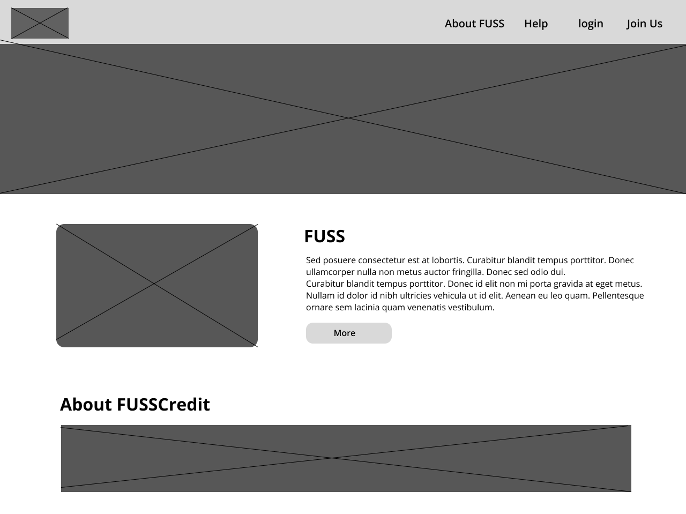

# Wireframes

## 1. Home Page

**Annotations:**
- Design Choice: Clean landing page with top navigation (About, Help, Login, Join Us) for quick access. Large image/banner to introduce the platform.

- Functionality: “About FUSS” and “About FUSSCredit” sections give first-time visitors a clear overview. AS they will be curious about the FussCredit.

- Placeholders: Image boxes for branding/illustrations. Text placeholders summarise the platform’s mission.

- Backend Interaction: Links to registration/login system, backend will serve dynamic content (e.g., testimonials, recent news).

## 2. Login Page

**Annotations:**
- Design Choice: Centered login form for focus, with minimal distractions. Navigation bar (About, Help, Join Us) remains for quick access.

- Functionality: Secure admin authentication with email/password. Option to switch to student login.

- Placeholders: Simple form fields and buttons. Error/success messages would be dynamically displayed.

- Backend Interaction: Credentials validated via PHP + MySQL. Password hashing and session management handled server-side.

## 3. Student Dashboard

**Annotations:**
- Design Choice: Personalized layout with a welcome message,under that will show the student's FUSScredits, recent activity panel, and messaging area for quick communication. Sidebar with students tools/links for easy access and search bar for easy navigation. 

- Functionality: Students can track their FUSSCredit balance, see recent service activity, and access messaging for requests/negotiations.

- Placeholders: Boxes for recent activity (dynamic feed), profile, and messaging.

- Backend Interaction: Fetches student’s personal data, credit balance, active requests, and recent messages from the database.

## 4. Skills Exchange Page

**Annotations:**
- Design Choice: Grid-based card layout to display offered/requested skills clearly. Search bar and filters for usability. And sidebar with links for easy to access any page.

- Functionality: Students can browse/search skills by category, topic, or availability. Each card links to a student profile and allows initiating a service request.

- Placeholders: Cards with name, skill description, and FUSSCredit cost. Filter dropdown to refine results.

- Backend Interaction: Dynamic query to MySQL for skills matching search/filter. Clicking a card triggers backend request system.

## 5. Admin Dashboard

**Annotations:**
- Design Choice: Overview panel for system health with system stats, calendar, and recent activity feed. Sidebar for admin tools.

- Functionality: Admins can manage students, adjust credits, monitor system activity, and moderate content. Calendar view supports scheduling moderation or events.

- Placeholders: Graph/overview box (system stats), list of recent activities, student data.

- Backend Interaction: Backend pulls system-wide stats (active users, transactions, popular skills). Admin actions (suspend users, adjust credits) update database directly.

## Storyboards